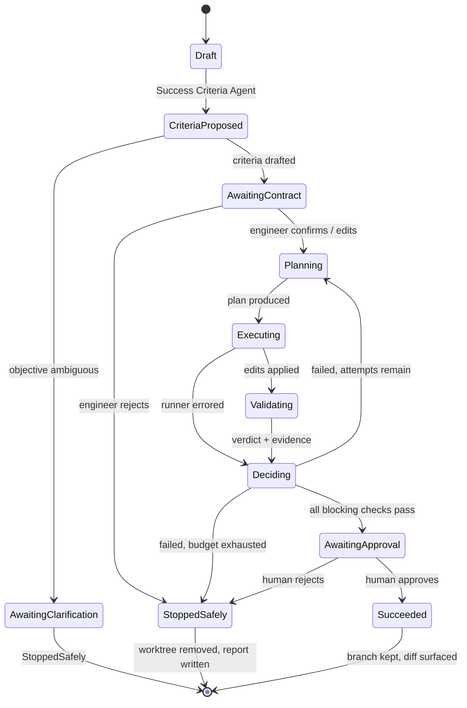

# 01 · Architecture

## The shape of it

```
┌──────────────────────────────────────────────────────────┐
│  web/  — React + React Flow                              │
│  canvas · node inspector · run console · YAML export     │
└───────────────┬──────────────────────────────────────────┘
                │ REST (CRUD, start/pause/stop, gate decisions)
                │ WebSocket (live ledger events)
┌───────────────▼──────────────────────────────────────────┐
│  api/          thin. no orchestration logic.             │
├──────────────────────────────────────────────────────────┤
│  graph/        executor: walks nodes, follows edges       │
├──────────────────────────────────────────────────────────┤
│  nodes/   input · agent · command · validator ·           │
│           decision · human_gate · success · stop          │
├─────────────────────────┬────────────────────────────────┤
│  agents/    4 roles     │  checks/   deterministic        │
│  runners/   harnesses   │            acceptance           │
│  ── LLMs live here ──   │  ── no LLM may enter ──         │
├─────────────────────────┴────────────────────────────────┤
│  workspace/    git worktree per attempt, rollback         │
│  ledger/       append-only receipts + cost                │
│  store/        SQLite: workflows, runs, attempts, gates   │
└──────────────────────────────────────────────────────────┘
                │
        ┌───────▼────────┐
        │ target repo    │  never edited directly —
        │ (git)          │  only through worktrees
        └────────────────┘
```

## Run state machine

This is the default loop from the brief. It is *the default template*, not a
hardcoded sequence — every transition below is an edge in the graph, and a user
can rewire it on the canvas.



Three things to notice:

- **`StoppedSafely` is a real terminal state, not an error.** Reaching it is a
  successful outcome for the *platform* even though the task was undelivered.
  It always rolls back and always writes a report.
- **`Deciding` is a node**, not an `if` statement buried in the executor. That is
  what makes the failure path configurable.
- **The attempt counter increments on the `Deciding → Planning` edge**, and the
  failure evidence rides along with it.

## Core contracts

Define these in `engine/src/loopctl/schemas/` on day one. Both halves of the team
code against them.

```python
class SuccessCriterion:
    id: str
    statement: str            # "coverage on src/client.py is at least 85%"
    check: CheckSpec | None   # how it is measured; None = advisory only
    blocking: bool            # can this alone fail the run?
    priority: Literal["must", "should"]
    source: Literal["user", "agent", "hybrid"]

class CheckResult:
    check_id: str
    passed: bool
    evidence: Evidence        # command, exit code, stdout/stderr, parsed detail
    duration_ms: int
    determinism_key: str      # sha256(workspace_git_sha + check_config)

class NodeOutcome:
    status: Literal["success", "failure", "clarification", "awaiting_human"]
    payload: dict
    cost: CostRecord

class ClarificationRequest:
    question: str
    conflicting_requirements: list[str]
    options: list[str]
    blocking: bool

class LedgerEvent:
    ts: datetime
    run_id: str
    attempt: int
    node_id: str
    actor: Literal["agent", "check", "human", "system"]
    type: str
    payload: dict
    duration_ms: int
    cost: CostRecord | None
```

`determinism_key` is the load-bearing field. A check's verdict is a pure function
of the workspace's git sha and the check's own configuration, so the same key must
always yield the same result. Cache on it, and you can *demonstrate* to a judge
that re-running the validator is not a re-roll.

## The runner abstraction

The brief requires a real agent harness with filesystem and shell capability, and
requires that model/provider/backend be configuration rather than something
welded to the orchestrator. One narrow protocol buys both:

```python
class AgentRunner(Protocol):
    def run(self, *, prompt: str, workspace: Path, tools: list[str],
            model: str, timeout_s: int) -> RunResult: ...

class RunResult:
    transcript: list[Message]
    files_changed: list[FileChange]   # path + diff
    commands_run: list[CommandRecord]
    exit_status: Literal["completed", "timeout", "error"]
    cost: CostRecord
```

Four implementations: `ClaudeCodeRunner`, `CursorRunner`, `AiderRunner`,
`FakeRunner`.

**Build `FakeRunner` first.** It replays a scripted sequence of file edits from a
fixture. With it you can develop and test the entire loop — including a
deliberately failing first attempt — with zero tokens, zero latency, and perfect
reproducibility in CI. Teams that skip this spend the last day debugging
orchestration through a $0.40, 90-second feedback cycle.

## Workspace isolation

```
target-repo/                  base checkout. read-only to agents. always green.
.artifacts/
  runs/<run_id>/
    ledger.jsonl              append-only receipts
    report.md                 final honest report
    attempt-1/
      worktree/               git worktree, branch loopctl/<run_id>/attempt-1
      plan.md
      transcript.json
      checks/*.json           each CheckResult with full evidence
    attempt-2/
      ...
```

`git worktree add` per attempt from the base ref. Rollback on safe stop is
`git worktree remove --force` plus branch deletion — the base repo cannot be
dirty because nothing ever wrote to it.

If you get to it, running each attempt's commands inside a container is the
stronger version (the brief lists it as a bonus). Worktrees are enough to score.

## Where cost is captured

Every LLM call and every subprocess returns a `CostRecord`. The node attaches it
to its `NodeOutcome`; the executor writes it to the ledger. Totals are derived by
summing the ledger — never tracked in a separate counter that can drift.

Report per run, per attempt, and per node: model calls, input/output tokens,
dollars, wall-clock. The brief asks for cost "per story and per stage"; ledger
events carry `node_id` and `attempt`, so both roll-ups are a group-by.
